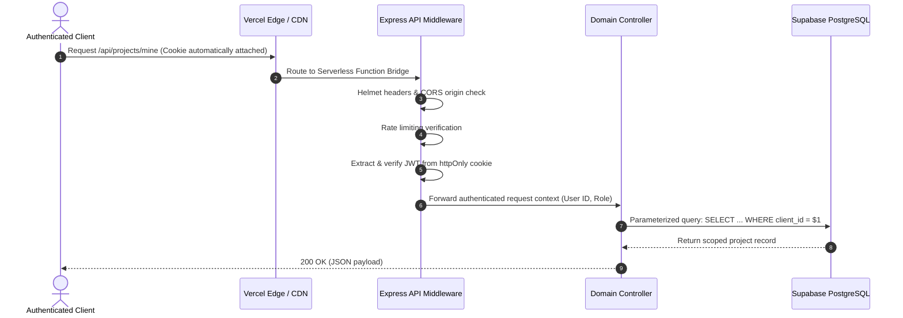

# System Architecture

## 1. High-Level Architecture Overview

SGS Creations is engineered with a clean, decoupled architecture separating the client-side user interface, backend application programming interface, database persistence layer, and external transactional communication services.

```mermaid
flowchart TD
    subgraph ClientLayer ["Client Layer"]
        UserBrowser["User Browser / Mobile Device"]
    end

    subgraph EdgeRouting ["Edge & CDN Layer - Vercel"]
        EdgeCDN["Vercel Edge Network & Global CDN"]
        StaticAssets["Static Assets - Vite HTML, CSS, JS"]
        ServerlessBridge["Serverless Function Bridge - /api/*"]
    end

    subgraph BackendLayer ["Backend Application Layer"]
        ExpressApp["Express 5 REST API Engine"]
        Middleware["Security & Auth Middleware"]
        Controllers["Domain Controllers"]
    end

    subgraph PersistenceLayer ["Data & External Services"]
        SupabaseDB[("Supabase PostgreSQL - Pool & RLS")]
        SMTPServer["SMTP Email Gateway - OTP Delivery"]
    end

    UserBrowser -->|"HTTPS Request"| EdgeCDN
    EdgeCDN -->|"Client Routes & Static"| StaticAssets
    EdgeCDN -->|"API Requests /api/*"| ServerlessBridge
    ServerlessBridge --> ExpressApp
    ExpressApp --> Middleware
    Middleware --> Controllers
    Controllers -->|"Parameterized SQL"| SupabaseDB
    Controllers -->|"SMTP via Nodemailer"| SMTPServer


---

## 2. Core Architectural Components

### 2.1 Vercel Edge Hosting & Static Distribution
* **Global Edge CDN**: Static frontend assets compiled by Vite (HTML, minified JavaScript, and CSS bundles) are cached globally across Vercel's edge nodes.
* **Low Latency**: Client devices receive static application shells instantly from the nearest regional point of presence (PoP).

### 2.2 Vercel Serverless API Bridge
* The Node.js Express API is deployed without requiring dedicated persistent container instances.
* A serverless function entry bridge maps inbound requests matching `/api/*` directly to the Express application instance.
* All middleware pipelines, routing logic, rate limiting, and database connections operate consistently within this serverless environment.

### 2.3 Single Page Application (SPA) Routing & Fallback
* Client-side navigation is orchestrated in the browser using `react-router-dom`.
* To prevent `404 NOT_FOUND` errors when users directly access or refresh deep URLs (such as `/home`, `/plans`, or `/auth/login`), edge rewrite rules redirect non-API requests to `index.html`.
* The client application receives the initial HTML document and hydrates the exact matching route in the browser.

### 2.4 Database Persistence & Supabase Connection Pooling
* **Managed Relational Storage**: All system state (user records, project milestones, custom design inquiries, creations showcase, plans, and social media channels) resides in a managed PostgreSQL database hosted on Supabase.
* **Connection Pooling (`pg`)**: The backend connects using a pooled PostgreSQL client, enabling efficient reuse of database sockets across concurrent serverless invocations.
* **Row-Level Security (RLS)**: Enforces isolation and access policies directly inside the database engine.

### 2.5 Transactional Email Delivery (SMTP)
* **Account Verification**: When a user registers or requests password recovery, the backend generates a cryptographically random 6-digit one-time password (OTP).
* **Delivery Channel**: The backend communicates directly with an authenticated SMTP gateway (Nodemailer over TLS) to dispatch styled HTML verification emails.

---

## 3. End-to-End Architectural Flows

### 3.1 Authentication & Session Management Flow
```mermaid
sequenceDiagram
    autonumber
    actor Client as User / Browser
    participant API as Express REST API
    participant DB as Supabase PostgreSQL
    participant Mail as SMTP Email Gateway

    Client->>API: POST /api/auth/register (Credentials & Details)
    API->>API: Validate input (Zod) & Hash password (bcrypt, 12 rounds)
    API->>DB: Store pending registration & 6-digit OTP
    API->>Mail: Send verification email with OTP
    API-->>Client: 201 Created (Prompt for OTP)

    Client->>API: POST /api/auth/verify-otp (User ID + 6-digit OTP)
    API->>DB: Verify OTP & check 10-minute expiry
    API->>DB: Activate user account & create client profile
    API->>API: Sign JSON Web Token (JWT)
    API-->>Client: 200 OK + Set-Cookie (JWT in httpOnly, Secure, SameSite=Lax)
```

### 3.2 Authenticated Request Flow


---

## 4. Separation of Concerns

* **Frontend**: Pure UI rendering, client-side routing, user input capture, micro-animations, and presentation logic. Holds no database connections and stores no sensitive administrative keys.
* **API Layer**: Centralized business logic, schema parsing, authentication validation, role-based authorization, rate limiting, and email dispatching.
* **Database Layer**: ACID-compliant transactional persistence, integrity constraints, foreign key cascades, unique indices, and row-level access control.
